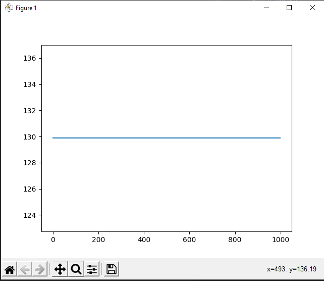
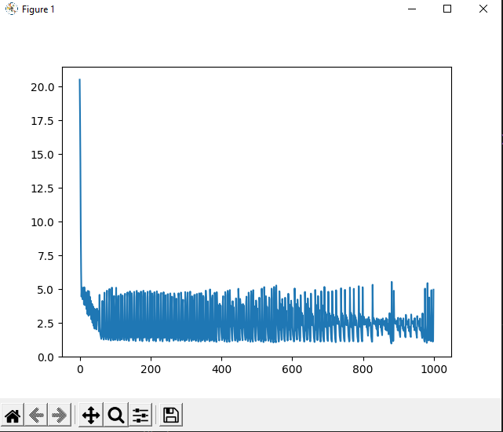

# Task 4.2: Regresija ar svaru apmacibas modeli ar vairākiem parametriem (4.8)

Atrisināju, lai tiek uzģenerēts grafiks, bet šaubos vai ir pareizi.

Velaizporojam paris jautajumi: 

Es nesaprotu kāpēc šie ir adevkāti back-propogation funkcijas:
    layer_1 = linear(W_1, b_1, x)
    layer_2 = tanh(layer_1)
    layer_3 = linear(W_2, b_2, layer_2)
    layer_4 = tanh(layer_3)
    layer_5 = linear(W_3, b_3, layer_4)

    d_layer_1 = dW_linear(W_1, b_1, x)
    d_layer_2_non_lin = dx_tanh(layer_1)

    d_layer_3 = dx_linear(W_2, b_2, layer_4)
    d_layer_3_non_lin = dx_tanh(layer_3)
    d_layer_4 = dx_linear(W_3, b_3, layer_5)
    d_loss = dy_prim_loss_mse(y_prim, y)

Kāpēc layer_1 tiek iegūts atvasinot to pašu fiju: linear(W_1, b_1, x) > dW_linear(W_1, b_1, x), bet d_layer_3 tiek iegūts atvasinot citu layer:
linear(W_2, b_2, layer_2) > dx_linear(W_2, b_2, layer_4). Tas pats notiek d_layer_4. Kapēc tā?

kapec line 91 vajag transpose? Kā var noteikt ka to vajag?

### List of implemented functions

3. MSE and its derivative

~~~
def loss_mse(y_prim, y):
    return np.mean(np.sum((y_prim - y)**2))
~~~

jeb pārveidots lai nemestos errori strādājot ar matricām: 

~~~
def loss_mse(y_prim, y):
    return np.mean(np.sum((y_prim - np.expand_dims(y, axis=-1))**2))

def dy_prim_loss_mse(y_prim, y):
    return 2*(y_prim - np.expand_dims(y, axis=-1)) #or is it 2*np.mean(np.sum(y_prim - y)) ?
~~~

Var rerdzēt mana šaubas par pareizo pierakstu, debagojot, atšķirība rezultātā nav.

4. Model implementation

~~~
def linear(W, b, x):
    prod_W = np.squeeze(W.T @ np.expand_dims(x, axis =-1), axis =-1)
    return prod_W + b

def tanh(x):
    result = (np.exp(x)-np.exp(-x))/np.exp(x)+np.exp(-x)
    return result

def model(x, W_1, b_1, W_2, b_2, W_3, b_3):
    layer_1 = linear(W_1, b_1, x)
    layer_2 = tanh(layer_1)
    layer_3 = linear(W_2, b_2, layer_2)
    layer_4 = tanh(layer_3)
    layer_5 = linear(W_3, b_3, layer_4)
    return layer_5
~~~

Result:

# Task 4.1: Regressija ar svaru apmacibas modeli (4.7)

No video nokopēju SGD algoritmu, likās ļoti sarežģīts un nedomāju ka pats tādu būtu uztaisijis ar pirmo mēģinājumu. 
Modeļa implemnetācija un svaru apmacibas augstakā līmenī liekas skaidra, bet kļuva grūtāk, kad sāku pildīt mājasdrabu (vairāku dimensiju matricu parametri).

1. Jautājums Kā var saprast kurām matricām vajag izmantot dot produktu bet kuras var vienkārši sareizināt?

šeit es biju confused jo shape ir sekojoši, d_loss - (4,1), layer_3 - (8,1,1) before transformation - (8,1), layer_1 - (4,1), layer_2 - (4,8).
Skatoties uz shape es pieņemtu ka šīs matricas nevar sareizināt, bet pec tam kad ir izveidots 4x8 dot produkts, mums izdodas sareizināt 4x8 ar 4x1 un 4x8. kā?

### List of implemented functions

2. Linear function

~~~
def linear(W, b, x):
    prod_W = np.squeeze(W.T @np.expand_dims(x, axis=-1), axis=-1)
    return prod_W + b
~~~

3. Derivatives for each variable:

~~~
def dW_linear(W, b, x):
    return x

def db_linear(W, b, x):
    return 1

def dx_linear(W, b, x):
    return W
~~~

4. Loss functions:

~~~
def dy_prim_loss_mae(y_prim, y):
    return (y_prim - y) / (np.abs(y_prim - y) + 1e-8)

def dW_1_loss(x, W_1, b_1, W_2, b_2, y_prim, y):
    d_layer_1 = dW_linear(W_1, b_1, x)
    d_layer_2 = dx_sigmoid(linear(W_1, b_1, x))
    d_layer_3 = np.expand_dims(dx_linear(W_2, b_2, sigmoid(linear(W_1, b_1, x))), axis=-1)
    d_loss = dy_prim_loss_mae(y_prim, y)
    d_dot_3 = np.squeeze(d_loss @ d_layer_3, axis=-1).T
    return d_dot_3 * d_layer_2 * d_layer_1

def db_1_loss(x, W_1, b_1, W_2, b_2, y_prim, y):
    d_layer_1 = db_linear(W_1, b_1, x)
    d_layer_2 = dx_sigmoid(linear(W_1, b_1, x))
    d_layer_3 = np.expand_dims(dx_linear(W_2, b_2, sigmoid(linear(W_1, b_1, x))), axis=-1)
    d_loss = dy_prim_loss_mae(y_prim, y)
    d_dot_3 = np.squeeze(d_loss @ d_layer_3, axis=-1).T
    return d_dot_3 * d_layer_2 * d_layer_1

def dW_2_loss(x, W_1, b_1, W_2, b_2, y_prim, y):
    d_layer_3 = dW_linear(W_2, b_2, sigmoid(linear(W_1, b_1, x)))
    d_loss = dy_prim_loss_mae(y_prim, y)
    return d_loss * d_layer_3

def db_2_loss(x, W_1, b_1, W_2, b_2, y_prim, y):
    d_layer_3 = db_linear(W_2, b_2, sigmoid(linear(W_1, b_1, x)))
    d_loss = dy_prim_loss_mae(y_prim, y)
    return d_loss * d_layer_3
~~~

5. SGD implementation

~~~
dW_1 = np.sum(dW_1_loss(X, W_1, b_1, W_2, b_2, Y_prim, Y))
    dW_2 = np.sum(dW_2_loss(X, W_1, b_1, W_2, b_2, Y_prim, Y))
    db_1 = np.sum(db_1_loss(X, W_1, b_1, W_2, b_2, Y_prim, Y))
    db_2 = np.sum(db_2_loss(X, W_1, b_1, W_2, b_2, Y_prim, Y))

    W_1 -= dW_1 * learning_rate
    W_2 -= dW_2 * learning_rate
    b_1 -= db_1 * learning_rate
    b_2 -= db_2 * learning_rate
~~~

6. Result

