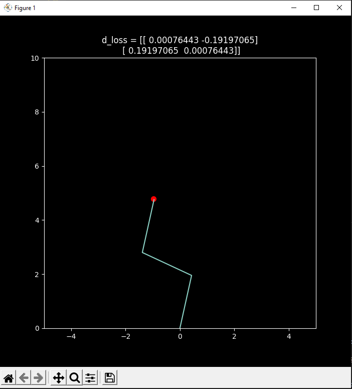
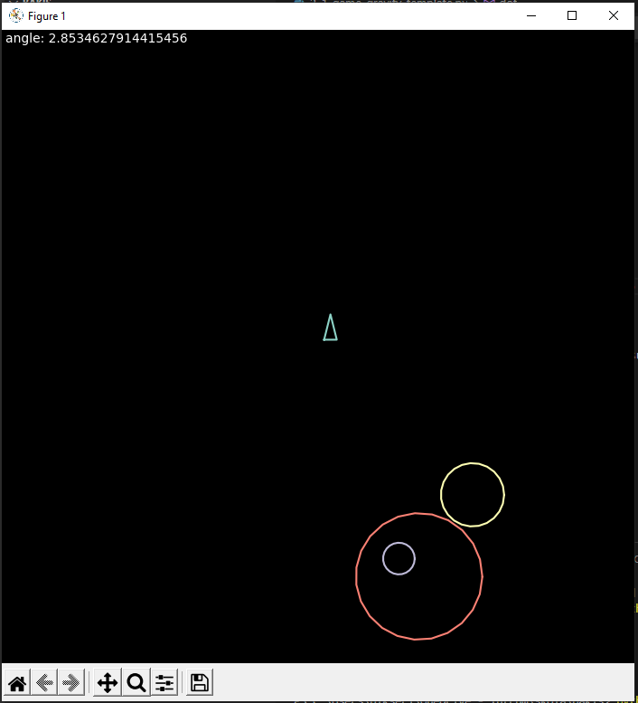
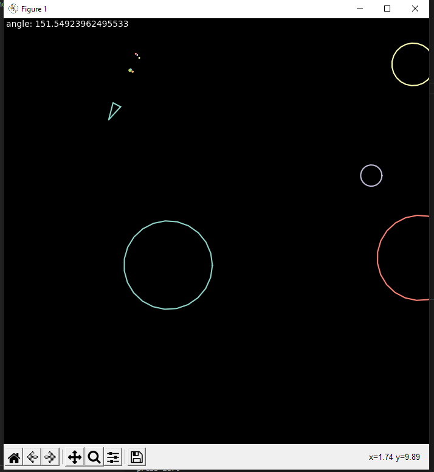
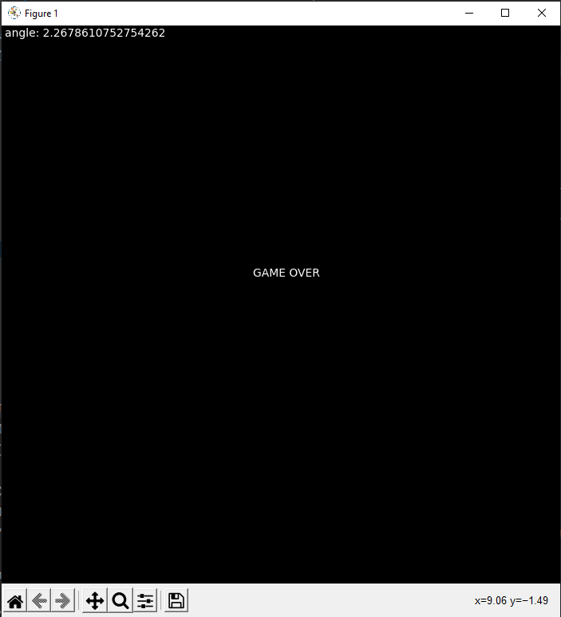

# Task 5: Regressija ar svaru apmacibas modeli ar vairākiem parametriem (4.8)

Nesanāk līdz galam. Liekas ka modeļa izveide sanāca un ir vienkārša(ja pareizi sapratu). Izmantojot debugger, sanāca progress ar modeļa izveidi un loss funkciju.
Ir vairāki jautājumi, primāri par SGD. Palielam apstājos pie d_dot_3 = d_loss @ d_layer_3 - nezinu kā tālāk risināt.

1. Jautājums: Kā noteikt cik lielas matricas vajag izmantot b_n un W_n? Kā vispār domāt par matricu izmēriem caur algoritma izpildi? 

Es pievienoju papildu parametrus X matricai:
~~~
X = np.array([[0.0, 2.0], [2.0, 2.0], [5.0, 2.5], [11.0, 3.0]]) # +2000
Y = np.array([2.1, 4.0, 5.5, 8.9]) # *1000

X = np.expand_dims(X, axis=-1) # in_features = 1
Y = np.expand_dims(Y, axis=-1) # out_features = 1
~~~

Un tad es izveidoju "neironus":
~~~
W_1 = np.zeros((1,8))
b_1 = np.zeros((8,))
W_2 = np.zeros((8,8))
b_2 = np.zeros((8, ))
W_3 = np.zeros((8,1))
b_3 = np.zeros((1, ))
~~~
Es gan galīgi nesaprotu kā noteikt cik daudz viņus kura slānī vajag. Es uz random izvēlējos šīs vērtības kas ir, bet mainot tās, visu laiku sastopos ar erroriem talāk kodā - kas saistīts ar dot produktam neatbilstošiem izmēriem. Piemēram šeit:

d_loss ir 4x2x1 un d_layer_3 ir 8x8x1

2. Jautājums: Kā saprast, kur vajag veikt matricu pārveidojumus?

Palielam tas pats jautājums, nesaprotu īsti, kā veikt pārveidojumus, lai errori kā augšējais tiktu atrisināti. Manā uztverē ir sekojošās vietas kur to darīt - lineārās funkcijas laikā, modeļa soļu laikā vai loss funkcijās.

### List of implemented functions

3. MSE and its derivative

~~~
def loss_mse(y_prim, y):
    return np.mean(np.sum((y_prim - y)**2))
~~~

jeb pārveidots lai nemestos errori strādājot ar matricām: 

~~~
def loss_mse(y_prim, y):
    return np.mean(np.sum((y_prim - np.expand_dims(y, axis=-1))**2))

def dy_prim_loss_mse(y_prim, y):
    return 2*(y_prim - np.expand_dims(y, axis=-1)) #or is it 2*np.mean(np.sum(y_prim - y)) ?
~~~

Var rerdzēt mana šaubas par pareizo pierakstu, debagojot, atšķirība rezultātā nav.

4. Model implementation

~~~
def linear(W, b, x):
    prod_W = np.squeeze(W.T @ np.expand_dims(x, axis =-1), axis =-1)
    return prod_W + b

def tanh(x):
    result = (np.exp(x)-np.exp(-x))/np.exp(x)+np.exp(-x)
    return result

def model(x, W_1, b_1, W_2, b_2, W_3, b_3):
    layer_1 = linear(W_1, b_1, x)
    layer_2 = tanh(layer_1)
    layer_3 = linear(W_2, b_2, layer_2)
    layer_4 = tanh(layer_3)
    layer_5 = linear(W_3, b_3, layer_4)
    return layer_5
~~~

# Task 4: Regressija ar svaru apmacibas modeli (4.7)

No video nokopēju SGD algoritmu, likās ļoti sarežģīts un nedomāju ka pats tādu būtu uztaisijis ar pirmo mēģinājumu. 
Modeļa implemnetācija un svaru apmacibas augstakā līmenī liekas skaidra, bet kļuva grūtāk, kad sāku pildīt mājasdrabu (vairāku dimensiju matricu parametri).

1. Jautājums Kā var saprast kurām matricām vajag izmantot dot produktu bet kuras var vienkārši sareizināt?

šeit es biju confused jo shape ir sekojoši, d_loss - (4,1), layer_3 - (8,1,1) before transformation - (8,1), layer_1 - (4,1), layer_2 - (4,8).
Skatoties uz shape es pieņemtu ka šīs matricas nevar sareizināt, bet pec tam kad ir izveidots 4x8 dot produkts, mums izdodas sareizināt 4x8 ar 4x1 un 4x8. kā?

### List of implemented functions

2. Linear function

~~~
def linear(W, b, x):
    prod_W = np.squeeze(W.T @np.expand_dims(x, axis=-1), axis=-1)
    return prod_W + b
~~~

3. Derivatives for each variable:

~~~
def dW_linear(W, b, x):
    return x

def db_linear(W, b, x):
    return 1

def dx_linear(W, b, x):
    return W
~~~

4. Loss functions:

~~~
def dy_prim_loss_mae(y_prim, y):
    return (y_prim - y) / (np.abs(y_prim - y) + 1e-8)

def dW_1_loss(x, W_1, b_1, W_2, b_2, y_prim, y):
    d_layer_1 = dW_linear(W_1, b_1, x)
    d_layer_2 = dx_sigmoid(linear(W_1, b_1, x))
    d_layer_3 = np.expand_dims(dx_linear(W_2, b_2, sigmoid(linear(W_1, b_1, x))), axis=-1)
    d_loss = dy_prim_loss_mae(y_prim, y)
    d_dot_3 = np.squeeze(d_loss @ d_layer_3, axis=-1).T
    return d_dot_3 * d_layer_2 * d_layer_1

def db_1_loss(x, W_1, b_1, W_2, b_2, y_prim, y):
    d_layer_1 = db_linear(W_1, b_1, x)
    d_layer_2 = dx_sigmoid(linear(W_1, b_1, x))
    d_layer_3 = np.expand_dims(dx_linear(W_2, b_2, sigmoid(linear(W_1, b_1, x))), axis=-1)
    d_loss = dy_prim_loss_mae(y_prim, y)
    d_dot_3 = np.squeeze(d_loss @ d_layer_3, axis=-1).T
    return d_dot_3 * d_layer_2 * d_layer_1

def dW_2_loss(x, W_1, b_1, W_2, b_2, y_prim, y):
    d_layer_3 = dW_linear(W_2, b_2, sigmoid(linear(W_1, b_1, x)))
    d_loss = dy_prim_loss_mae(y_prim, y)
    return d_loss * d_layer_3

def db_2_loss(x, W_1, b_1, W_2, b_2, y_prim, y):
    d_layer_3 = db_linear(W_2, b_2, sigmoid(linear(W_1, b_1, x)))
    d_loss = dy_prim_loss_mae(y_prim, y)
    return d_loss * d_layer_3
~~~

5. SGD implementation

~~~
dW_1 = np.sum(dW_1_loss(X, W_1, b_1, W_2, b_2, Y_prim, Y))
    dW_2 = np.sum(dW_2_loss(X, W_1, b_1, W_2, b_2, Y_prim, Y))
    db_1 = np.sum(db_1_loss(X, W_1, b_1, W_2, b_2, Y_prim, Y))
    db_2 = np.sum(db_2_loss(X, W_1, b_1, W_2, b_2, Y_prim, Y))

    W_1 -= dW_1 * learning_rate
    W_2 -= dW_2 * learning_rate
    b_1 -= db_1 * learning_rate
    b_2 -= db_2 * learning_rate
~~~

6. Result

# Task 3: Regression for comparing mae vs mse (4.6)

Vienkārši un saprotami priekš viendimensionālas datu kopas.

### List of implemented functions

1. Sigmoid function

~~~
def sigmoid(x):
    return 1.0 / (1.0 + np.exp(-x))
~~~

2. Loss mae

~~~
def loss_mae(y_prim, y):
    return np.sum(np.abs(y_prim - y))
~~~

2. Loss mse

~~~
def loss_mse(y_prim, y):
    return np.mean(np.sum((y_prim - y)**2))
~~~

2. Model

~~~
def model(x, W_1, b_1, W_2, b_2):
    layer_1 = linear(W_1, b_1, x)
    layer_2 = sigmoid(layer_1)
    layer_3 = linear(W_2, b_2, layer_2)
    return layer_3
~~~

# Task 2: Inverse kintetics

Kopumā gāja labi, nebija problemas izveidot atvasinājuma funkcijas un rezultāts sanāca veiksmīgs.

Man ir 2 jautājumi:
1. kāpēc ir nepieciešama loss funkcija
2. Kā īstenot roku nepāriešanu pāri otrai? (Es ilgi mēģināju bet nesanāca)

### List of implemented functions

1. Rotation matrix

~~~
def rotation(theta):
    cos_theta = math.cos(theta)
    sin_theta = math.sin(theta)
    return np.array([
        [cos_theta, -sin_theta],
        [sin_theta, cos_theta],
    ])
~~~

2. Derivative of rotation matrix
~~~
def d_rotation(theta):
    cos_theta = math.cos(theta)
    sin_theta = math.sin(theta)
    return np.array([
        [-sin_theta, -cos_theta],
        [cos_theta, -sin_theta],
    ])
~~~

3. Angle rotation algorithm
~~~
d_theta_1 = np.sum(2 * (point_3 - target_point) * (dR1 @ t + dR1 @ R2 @ t))
theta_1 -= d_theta_1 * alpha

d_theta_2 = np.sum(2 * (point_3 - target_point) * (R1 @ dR2 @ t))
theta_2 -= d_theta_2 * alpha

d_theta_3 = np.sum(2 * (point_3 - target_point) * (R2 @ dR3 @ t)  )
theta_3 -= d_theta_3 * alpha
~~~

4. rotacijas aizliegums zem horizonta pirmajai rokai: 
~~~

if (theta_1 < 1.5 and theta_1 > -1.5):
    theta_1 -= d_theta_1 * alpha
else:
    theta_1 += d_theta_1 * alpha
~~~

# Task 1: Gravity game

Kopumā gāja labi, sākumā bija neskaidri kā strukturēt kodu un uz ko fokusēties, taču sanāca atkārtot matrix transformations un basic python syntaxi. Pēc code review sapratu ka svarīgākais bija combined matrix transformations un numpy specific sintaxes lietas. Tās pielabojot, sapratu ko mācīties talāk.

### List of implemented functions

1. Dot Function
~~~
def dot(X, Y):
    is_transposed = False

    X = np.atleast_2d(X)
    Y = np.atleast_2d(Y)

    if X.shape[1] != Y.shape[0]:
        is_transposed = True
        Y = np.transpose(Y)
    
    X_rows = X.shape[0]
    Y_columns = Y.shape[1]

    for X_row in range(X_rows):
        for Y_column in range(Y_columns):
            product[X_row, Y_column] = np.sum(X[X_row,:] * Y[:, Y_column])

    if is_transposed:
        product = np.transpose(product)
    
    if product.shape[0] == 1:
        product = product.flatten()

    return product
~~~

2. Vector normalization
~~~
def l2_normalize_vec2d(vec2d):
    length = math.sqrt(vec2d[0]**2 + vec2d[1]**2)
    normalized_vec2d = np.array([vec2d[0]/length, vec2d[1]/length])
    return normalized_vec2d
~~~

3. Translaiton matrix
~~~
def translation_mat(dx, dy):
    T = np.array([
        [1.0, 0.0, dx],
        [0.0, 1.0, dy],
        [0.0, 0.0, 1.0]
    ])
    return T
~~~

4. Scaling matrix
~~~
def scale_mat(dx, dy):
    T = np.array([
        [dx, 0.0, 0.0],
        [0.0, dy, 0.0],
        [0.0, 0.0, 1.0]
    ])
    return T
~~~

4. Circle generation
~~~
def drawCircle(radius):
        detail = 24
        circle = []
        d = 0
        x = 0
        while d < 375:
            circle.append([radius*np.cos(np.radians(d)), radius*np.sin(np.radians(d))])
            d +=375/detail
            x +=1

        return np.array(circle)
~~~

### 5. Additions

Pavadot laiku ar spēli mazliet pielaboju dažas lietas un satiriju kodu:

5.0 Izveidoju emission particle objektu
~~~
class EmissionParticle(MovableObject):
    def __init__(self, directionVector, position):
        super().__init__()
        self.speed = .75
        I = np.array([
            [1, 0],
            [0, 1],
        ])

        self.vec_pos = dot(position, I)

        radius = np.random.uniform(0.15, 0.3)

        s = drawCircle(radius)
        self.geometry = s

        directionChangeMatrix = np.array([
            [np.random.uniform(-1.5, -0.5), 0],
            [0, np.random.uniform(-1.5, -0.5)],
        ])
        self.vec_dir = dot(directionVector, directionChangeMatrix)
        self.lifespan = 1
    def update_movement(self, dt):
        self.lifespan -= dt
        super().update_movement(dt)
        self.geometry = self.geometry * .75
        self.speed -= dt * 0.6
        if self.lifespan < 0:
            self.geometry = clearMatrix(self.geometry)

def createEmissionParticles(player):
    particles = []
    particles.append(EmissionParticle(player.vec_dir, player.vec_pos))
    particles.append(EmissionParticle(player.vec_dir, player.vec_pos))
    particles.append(EmissionParticle(player.vec_dir, player.vec_pos))
    return np.array(particles)
~~~

5.1 Pievienoju stratēģiju spēles izbeigšanai - ja planēta pietuvojas pārāk tuvu speletajam, spele beidzas:

5.1.1 noteikt distanci starp diviem objektiem
~~~
def distanceBetweenTwoObjects(pos1, pos2):
    return np.sum((pos1 - pos2)**2)/2
~~~

5.1.2 Kā updatot izraisīto spēku spēlētājam, planētai pietuvojoties tuvāk
~~~
def updateForceOnPlayer(self:MovableObject):
    F = 9.82 * self.radius / distanceBetweenTwoObjects(self.vec_pos, player.vec_pos)*2
    F_vec = l2_normalize_vec2d(self.vec_pos - player.vec_pos)
    player.external_forces[self.planetNumber] = F * F_vec
~~~

5.1.3 Parbaude vai objekti ir saskrējušies:
~~~
def isCollided(firstObject:MovableObject, secondObject:MovableObject):
    d_2 = distanceBetweenTwoObjects(firstObject.vec_pos, secondObject.vec_pos)
    if d_2 < 0.2:
        return True
    return False
~~~

5.1.4 Spēles izbeigšana:
~~~
def closeWithGameOver():
    plt.text(x=-SPACE_SIZE+9, y=SPACE_SIZE-9, s=f'GAME OVER')
    plt.pause(5)
    global is_running
    is_running = False
~~~

5.1.5 Planētas update_movement implementācijai pievienoju izveidotās funkcijas:
~~~
class Planet(MovableObject):
    def __init__(self, name, index, radius):
        super().__init__()
        self.attribute_name = name
        self.speed = 0
        self.planetNumber = index
        print(radius)
        self.radius = radius

        s = drawCircle(self.radius)
        self.geometry = s

        self.vec_pos = np.array([np.random.uniform(-10.0, 10.0), np.random.uniform(-10.0, 10.0)])
        self.speed = 0
    
    def update_movement(self, dt):
        if isCollided(self, player):
            closeWithGameOver()
            
        super().update_movement(dt)

        updateForceOnPlayer(self)
~~~

### 6. Photos

